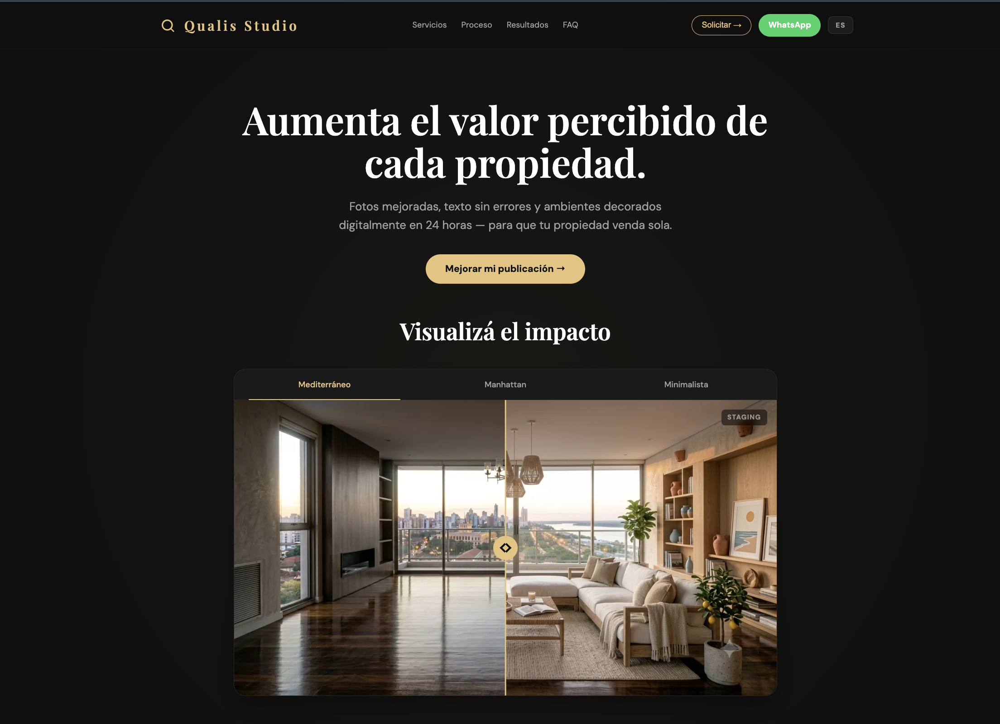

# Qualis Studio

Sitio web estático y trilingüe (ES/EN/PT) de **Qualis Studio**, un servicio de transformación visual inmobiliaria — staging digital, mejora fotográfica y contenido visual asistido por IA — enfocado en el mercado paraguayo.

## Por qué existe

Las propiedades con fotos profesionales y staging se perciben como de mayor valor y se venden más rápido. Qualis Studio ofrece esa transformación en menos de 24 horas; este sitio es su vitrina comercial y canal de captación (formulario + WhatsApp).

## Demo en vivo

**[luxbase.github.io/qs](https://luxbase.github.io/qs/)**



## Stack

| Capa | Tecnología |
| :--- | :--- |
| Framework | [Astro](https://astro.build/) 6 (salida estática) |
| Hosting | GitHub Pages (`luxbase/qs`) |
| Formulario | SubmitKit (endpoint público del lado del cliente) |
| Contacto | WhatsApp (`src/constants.ts`) |
| Idiomas | Español · English · Português (`src/i18n`) |

Sin backend propio: el sitio compila a HTML estático y el formulario envía a un endpoint de SubmitKit.

## Estructura

```
src/
  i18n/         # Diccionarios ES/EN/PT
  components/   # Hero, Comparison, FAQ, ContactModal, etc.
  layouts/      # Layout base + OG/Twitter/JSON-LD
  pages/        # index, [lang]/, privacidad, gracias
  constants.ts  # Número y URL de WhatsApp
docs/ops/       # SOPs internos (intake, política de credenciales)
```

## Desarrollo local

```bash
npm install
npm run dev      # servidor local de Astro
npm run build    # → dist/
npm test         # = astro build (misma verificación que CI)
```

No requiere variables de entorno.

## Despliegue

Cada push a `main` dispara [.github/workflows/deploy.yml](.github/workflows/deploy.yml): `npm audit` (nivel high) → `npm test` → build → deploy a GitHub Pages. El `base: '/qs/'` está configurado en [astro.config.mjs](astro.config.mjs).
